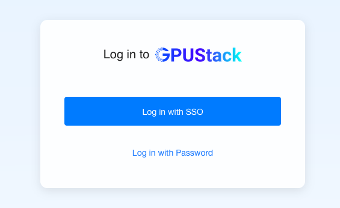
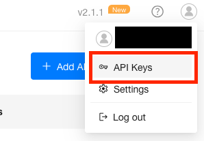

Wir experimentieren gerade mit [GPUstack](https://gpustack.ai/) als Proof-of-Concept für lokale LLMs. Der Open-Source-GPU-Cluster-Manager scheint auf den ersten Blick alles mitzubringen, was wir brauchen: vLLM plus SSO und OpenAI-kompatible APIs. Kein Cloud-Zwang, volle Kontrolle über unsere Daten, und das alles mit einer relativ unkomplizierten Einrichtung.

GPUstack ist kein Chat-Interface wie ChatGPT, sondern für die Verwendung mit APIs gedacht. Um das Chat-Interface kümmern wir uns an anderer Stelle.

> **Disclaimer:** Dieser Artikel ist keine offizielle Anleitung der Informatikdienste. Vorausgesetzt werden grundlegende Kenntnisse im Bereich KI und idealerweise auch KI-Agenten. Ich empfehle, KI-Tools nur für Aufgaben einzusetzen, die man sich auch selbst zutrauen würde.
>
> *Only let the AI do what you would feel comfortable doing yourself!*
{: .prompt-info }

## OpenAI-kompatible APIs

> **Was ist eine API?**
>
> Eine API (Application Programming Interface) ist eine Schnittstelle, über die Software-Anwendungen miteinander kommunizieren können. Sie definiert, wie Anfragen gestellt und Antworten erhalten werden, ohne dass die internen Funktionsweisen sichtbar sind. 
>
> APIs sind wie ein Menü in einem Restaurant - du kennst nicht den Weg, wie das Gericht zubereitet wird, aber du weißt, wie du es bestellen und erhalten kannst.
>
> Weitere Informationen findest du hier: [APIs für Einsteiger - MDN Web Docs](https://developer.mozilla.org/de/docs/Glossary/API)
{: .prompt-tip }


GPUstack bietet OpenAI-kompatible APIs, die sich als Standard für API Interaktionen mit LLMs durchgesetzt haben. Diese Kompatibilität ermöglicht eine reibungslose Integration in bestehende Workflows und Tools und erleichtert den Wechsel von Cloud-basierten Modellen zu lokalen Lösungen. In der Regel ist es möglich bestehende Anwendungen ohne große Änderungen weiterzuverwenden.

Die API unterstützt alle grundlegenden Funktionen wie:
- Textgenerierung (completions)
- Chat-Interaktionen (chat/completions)
- Prompt-Management
- Modell-Informationen abrufen

Details findest du in der [vollständigen Liste der verfügbaren API
Endpunkte](https://gpustack.unibe.ch/docs).


## GPUstack API Key erstellen

Als Erstes brauchen wir einen API-Key für GPUstack.

1. Auf [gpustack.unibe.ch](https://gpustack.unibe.ch) mit SSO einloggen.
    

2. **User → API Keys → Key erstellen und kopieren.**

    

>Den Key gut aufbewahren – er kommt gleich wieder zum Einsatz.
{: .prompt-tip }

## GPUstack APIs verwenden

### cURL Request

Du kannst GPUstack-APIs direkt mit cURL aufrufen:

```bash
curl -X POST https://gpustack.unibe.ch/v1/chat/completions \
  -H "Authorization: Bearer YOUR_API_TOKEN" \
  -H "Content-Type: application/json" \
  -d '{
    "model": "qwen3-vl-8b-instruct",
    "messages": [
      {
        "role": "user",
        "content": "Erkläre in einfachen Worten, was GPUstack ist."
      }
    ],
    "temperature": 0.7
  }'
```

### Kleines Python-Skript

Hier ist ein einfaches Python-Skript zur Integration:

```python
import openai

# Konfiguration für GPUstack
client = openai.OpenAI(
    api_key="YOUR_API_TOKEN",
    base_url="https://gpustack.unibe.ch/v1"
)

# API-Aufruf
response = client.chat.completions.create(
    model="qwen3-vl-8b-instruct",
    messages=[
        {"role": "user", "content": "Was sind die Vorteile von GPUstack für lokale KI-Entwicklung?"}
    ],
    temperature=0.7
)

print(response.choices[0].message.content)
```

### Verwendung mit Opencode

Mit [Opencode](https://opencode.ai) kannst du den Key in deinen Agent-Konfigurationen verwenden, um lokale KI-Agenten zu betreiben, die auf GPUstack basieren. Dies ermöglicht eine vollständig lokale Entwicklungsumgebung ohne Abhängigkeit von Cloud-Diensten - ganz ähnlich zu Claude Code, Codex oder Copilot.

Weitere Details findest du im Blog-Post über [lokale KI mit Opencode](/posts/local-ai-opencode/)


